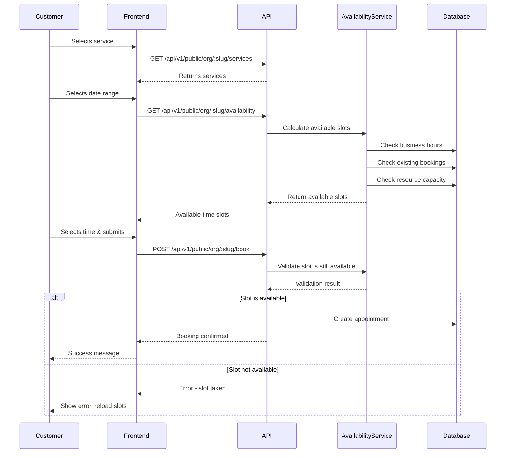

# Flexible Booking & Reservation System
## Complete Guide to Preventing Overbooking and Supporting Multiple Booking Types

---

## 🎯 Overview

This system is designed to handle **ANY type of reservation or booking**, from service appointments to hotel rooms, car rentals, equipment loans, apartment viewings, and more. It prevents overbooking through a multi-layered validation system and provides complete customization per organization.

### Supported Use Cases
- ✅ **Service Appointments** - Doctors, consultants, service providers
- ✅ **Hotel Rooms** - Room bookings with capacity management
- ✅ **Car Rentals** - Vehicle reservations with availability tracking
- ✅ **Equipment Rentals** - Tools, machinery, sports equipment
- ✅ **Property Viewings** - Apartment/house viewing appointments
- ✅ **Facilities** - Gyms, courts, pools, conference rooms
- ✅ **Virtual Services** - Online consultations, webinars
- ✅ **Any Custom Resource** - Fully flexible configuration

---

## 🏗️ System Architecture

### Core Components

```
┌─────────────────────────────────────────────────────────┐
│                   ORGANIZATION                           │
│  ├─ Business Hours (Mon-Sun scheduling)                 │
│  ├─ Holidays (Blocked dates)                           │
│  ├─ Timezone                                            │
│  └─ Settings (lead time, buffer times, etc.)           │
└─────────────────────────────────────────────────────────┘
                           │
         ┌─────────────────┴────────────────┐
         │                                   │
┌────────▼──────────┐             ┌─────────▼───────────┐
│    SERVICES       │             │    RESOURCES        │
│ ├─ Name           │             │ ├─ Type (staff,    │
│ ├─ Duration       │             │ │   room, vehicle, │
│ ├─ Buffer Times   │             │ │   equipment, etc)│
│ ├─ Price          │             │ ├─ Capacity        │
│ ├─ Lead Time      │             │ ├─ Availability    │
│ ├─ Max Booking    │             │ ├─ Custom Schedule │
│ └─ Resource Type  │             │ ├─ Blocked Dates   │
└───────────────────┘             │ └─ Attributes      │
                                  └────────────────────┘
         │                                   │
         └─────────────────┬────────────────┘
                           │
                ┌──────────▼──────────┐
                │   APPOINTMENTS       │
                │ ├─ Start Time        │
                │ ├─ End Time          │
                │ ├─ Resource/Worker   │
                │ ├─ Quantity          │
                │ ├─ Status            │
                │ └─ Customer Info     │
                └─────────────────────┘
```

---

## 🛡️ How Overbooking Prevention Works

### Multi-Layer Validation System

#### **Layer 1: Frontend Validation**
- Only displays available time slots
- Fetches real-time availability from API
- Disables past dates automatically
- Shows capacity in real-time

#### **Layer 2: Availability Service**
The `availabilityService` calculates available slots considering:

1. **Business Hours**
   - Organization-wide hours (Mon-Fri 9AM-5PM, etc.)
   - Resource-specific custom schedules
   - Day-of-week availability

2. **Holidays & Blocked Dates**
   - Organization holidays
   - Resource-specific maintenance periods
   - Custom blocked date ranges

3. **Existing Bookings**
   - Queries all confirmed/pending appointments
   - Checks for time slot conflicts
   - Considers buffer times before/after

4. **Lead Time Restrictions**
   ```javascript
   minLeadTimeHours: 2    // Can't book within 2 hours
   maxLeadTimeDays: 60    // Can't book more than 60 days ahead
   ```

5. **Buffer Times**
   ```javascript
   bufferBefore: 15   // 15 minutes before appointment
   bufferAfter: 15    // 15 minutes after appointment
   ```

6. **Resource Capacity**
   - Tracks simultaneous bookings
   - Prevents exceeding capacity limits
   - Quantity-based reservations

#### **Layer 3: Database-Level Validation**
- Atomic checks at booking creation time
- `Appointment.hasConflict()` method
- Compound indexes for fast conflict detection:
  ```javascript
  { orgId: 1, workerId: 1, startTime: 1 }
  { orgId: 1, resourceId: 1, startTime: 1 }
  ```

#### **Layer 4: Transaction-Like Booking**
```javascript
// Pseudo-code flow:
1. Check availability (real-time)
2. Lock time slot (conceptual)
3. Validate one more time
4. Create appointment
5. Return confirmation or error
```

---

## 📊 Data Models

### 1. Organization Model
```javascript
{
  name: "Acme Company",
  slug: "acme-company",
  timezone: "America/New_York",

  businessHours: [
    { dayOfWeek: 1, start: "09:00", end: "17:00" },  // Monday
    { dayOfWeek: 2, start: "09:00", end: "17:00" },  // Tuesday
    // ... etc
  ],

  holidays: [
    { date: "2025-12-25", name: "Christmas" },
    { date: "2025-01-01", name: "New Year" }
  ]
}
```

### 2. Resource Model (Universal for Any Bookable Item)
```javascript
{
  name: "Conference Room A" or "Toyota Camry" or "Laptop #5",
  type: "room" or "vehicle" or "equipment",
  capacity: 10,  // How many can be booked simultaneously

  availability: {
    schedule: [
      { dayOfWeek: 1, start: "09:00", end: "17:00" }
    ],
    blockedDates: [
      { startDate: "2025-01-10", endDate: "2025-01-15", reason: "Maintenance" }
    ],
    minLeadTimeHours: 2,
    maxLeadTimeDays: 90,
    bufferBefore: 0,
    bufferAfter: 30,
    slotInterval: 60
  },

  attributes: {
    // For vehicles
    make: "Toyota",
    model: "Camry",
    year: 2023,

    // For rooms
    size: "500 sq ft",
    floor: 3,
    amenities: ["WiFi", "Projector", "Whiteboard"],
    maxOccupancy: 10,

    // Custom fields
    custom: {
      anyField: "anyValue"
    }
  }
}
```

### 3. Service Model
```javascript
{
  name: "Hotel Room Booking",
  durationMinutes: 1440,  // 24 hours for hotel
  bufferBefore: 30,       // Cleaning time before
  bufferAfter: 60,        // Cleaning time after

  bookingSettings: {
    resourceType: "room",
    useResourceModel: true,
    requiresQuantity: false,
    maxQuantityPerBooking: 1,
    minLeadTimeHours: 4,
    maxLeadTimeDays: 365,
    allowedResources: [/* specific rooms */]
  }
}
```

### 4. Appointment Model
```javascript
{
  orgId: "...",
  serviceId: "...",
  workerId: "...",        // For staff-based bookings
  resourceId: "...",      // For resource-based bookings
  customerId: "...",

  startTime: "2025-01-20T10:00:00Z",
  endTime: "2025-01-20T11:00:00Z",

  quantity: 1,            // For multi-unit bookings
  status: "confirmed",
  source: "public_booking"
}
```

---

## 🔄 Complete Booking Flow

### Public Booking Process



---

## 🎛️ Configuration Examples

### Example 1: Hair Salon (Service-Based)

```javascript
// Service
{
  name: "Haircut",
  durationMinutes: 30,
  bufferBefore: 5,
  bufferAfter: 10,
  bookingSettings: {
    resourceType: "staff",
    useResourceModel: false,  // Uses User/Worker model
    minLeadTimeHours: 1,
    maxLeadTimeDays: 30
  }
}
```

### Example 2: Hotel (Room-Based)

```javascript
// Resource
{
  name: "Room 205",
  type: "room",
  capacity: 1,
  attributes: {
    bedType: "King",
    floor: 2,
    amenities: ["WiFi", "TV", "Mini Bar", "Ocean View"]
  }
}

// Service
{
  name: "Standard Room",
  durationMinutes: 1440,  // 24 hours
  bufferBefore: 60,       // Check-in prep
  bufferAfter: 120,       // Cleaning
  bookingSettings: {
    resourceType: "room",
    useResourceModel: true,
    minLeadTimeHours: 12,
    maxLeadTimeDays: 365
  }
}
```

### Example 3: Car Rental

```javascript
// Resource
{
  name: "Toyota Camry 2023",
  type: "vehicle",
  capacity: 1,
  attributes: {
    make: "Toyota",
    model: "Camry",
    year: 2023,
    licensePlate: "ABC-1234",
    fuelType: "Hybrid",
    transmission: "Automatic"
  }
}

// Service
{
  name: "Daily Car Rental",
  durationMinutes: 1440,  // 24 hours
  bufferBefore: 30,
  bufferAfter: 30,
  bookingSettings: {
    resourceType: "vehicle",
    useResourceModel: true,
    requiresQuantity: false,
    minLeadTimeHours: 2,
    maxLeadTimeDays: 90
  }
}
```

### Example 4: Equipment Rental (Multiple Units)

```javascript
// Resource
{
  name: "Professional Camera",
  type: "equipment",
  capacity: 5,  // Have 5 cameras available
  attributes: {
    brand: "Canon",
    model: "EOS R5",
    category: "Photography"
  }
}

// Service
{
  name: "Camera Rental",
  durationMinutes: 480,  // 8 hours
  bookingSettings: {
    resourceType: "equipment",
    useResourceModel: true,
    requiresQuantity: true,
    maxQuantityPerBooking: 3,  // Max 3 cameras per booking
    minLeadTimeHours: 4,
    maxLeadTimeDays: 60
  }
}
```

---

## 🔌 API Endpoints

### Get Available Slots
```http
GET /api/v1/public/org/:orgSlug/availability
Query params:
  - serviceId (required)
  - startDate (required, YYYY-MM-DD)
  - endDate (required, YYYY-MM-DD)

Response:
{
  "slots": [
    {
      "startTime": "2025-01-20T10:00:00Z",
      "endTime": "2025-01-20T11:00:00Z",
      "workerId": "...",
      "available": true
    }
  ]
}
```

### Create Booking
```http
POST /api/v1/public/org/:orgSlug/book
Body:
{
  "serviceId": "...",
  "date": "2025-01-20",
  "time": "10:00",
  "customerName": "John Doe",
  "customerEmail": "john@example.com",
  "customerPhone": "+1234567890",
  "notes": "Optional notes"
}

Response:
{
  "appointment": {
    "id": "...",
    "startTime": "2025-01-20T10:00:00Z",
    "endTime": "2025-01-20T11:00:00Z",
    "status": "confirmed"
  }
}
```

---

## 🎨 Frontend Integration

### Fetch Available Slots
```javascript
const fetchAvailableSlots = async (serviceId, startDate, endDate) => {
  const response = await axios.get(
    `${API_URL}/api/v1/public/org/${orgSlug}/availability`,
    {
      params: { serviceId, startDate, endDate }
    }
  );

  return response.data.data.slots;
};
```

### Display Calendar with Only Available Slots
```jsx
<DatePicker
  minDate={new Date()}
  value={selectedDate}
  onChange={setSelectedDate}
  shouldDisableDate={(date) => {
    // Only enable dates that have available slots
    return !availableSlots.some(slot =>
      isSameDay(new Date(slot.startTime), date)
    );
  }}
/>

{/* Show only available time slots */}
<Select value={selectedTime} onChange={setSelectedTime}>
  {availableSlots
    .filter(slot => isSameDay(new Date(slot.startTime), selectedDate))
    .map(slot => (
      <MenuItem key={slot.startTime} value={format(slot.startTime, 'HH:mm')}>
        {format(slot.startTime, 'h:mm a')}
      </MenuItem>
    ))
  }
</Select>
```

---

## ⚡ Performance & Scalability

### Optimizations

1. **Database Indexes**
   - Compound indexes on frequently queried fields
   - Sparse indexes for optional fields (resourceId)

2. **Caching**
   - Cache availability calculations (Redis)
   - Invalidate on new bookings

3. **Batch Queries**
   - Fetch all appointments in date range once
   - Calculate slots in-memory

4. **Rate Limiting**
   - Prevent abuse of availability endpoint
   - Throttle concurrent booking attempts

---

## 🔒 Security & Race Conditions

### Handling Concurrent Bookings

```javascript
// Pseudo-code with transaction-like behavior
async function createBooking(data) {
  // 1. Start "transaction"
  const session = await mongoose.startSession();
  session.startTransaction();

  try {
    // 2. Re-check availability within transaction
    const isAvailable = await checkAvailability(data);

    if (!isAvailable) {
      throw new Error('Slot no longer available');
    }

    // 3. Create appointment
    const appointment = await Appointment.create([data], { session });

    // 4. Commit
    await session.commitTransaction();
    return appointment;

  } catch (error) {
    await session.abortTransaction();
    throw error;
  } finally {
    session.endSession();
  }
}
```

---

## 📈 Analytics & Monitoring

### Track Key Metrics

1. **Utilization Rate**
   ```javascript
   Resource.getUtilizationStats(orgId, resourceId, startDate, endDate)
   // Returns: { utilizationPercentage: 75.5, bookedSlots: 150, totalSlots: 200 }
   ```

2. **Popular Time Slots**
   - Track which times get booked most
   - Optimize business hours accordingly

3. **No-Show Rate**
   - Monitor appointment statuses
   - Implement overbooking strategies if needed

---

## ✅ Best Practices

### For Service Providers

1. **Set Realistic Buffer Times**
   - Allow time for setup/cleanup
   - Prevents back-to-back stress

2. **Configure Lead Times**
   - Minimum: Prevent last-minute chaos
   - Maximum: Control planning horizon

3. **Use Blocked Dates**
   - Schedule maintenance periods
   - Block holidays proactively

4. **Monitor Capacity**
   - Review utilization reports
   - Adjust availability as needed

### For Developers

1. **Always Fetch Fresh Availability**
   - Don't cache slots on frontend
   - Re-fetch before showing booking form

2. **Handle Errors Gracefully**
   - "Slot no longer available" → Show updated slots
   - Network errors → Retry logic

3. **Show Real-Time Feedback**
   - Loading states during availability checks
   - Success/error messages immediately

4. **Test Edge Cases**
   - Concurrent bookings (same slot)
   - Timezone conversions
   - Boundary times (start/end of day)

---

## 🎓 Summary

This system ensures **zero overbooking** through:

✅ **Multiple validation layers** (frontend, service, database)
✅ **Real-time availability checking**
✅ **Flexible resource modeling** (staff, rooms, vehicles, equipment, etc.)
✅ **Customizable constraints** per organization and service
✅ **Buffer times and lead time management**
✅ **Capacity tracking** for multi-unit resources
✅ **Business hours and holiday awareness**
✅ **Transaction-like booking process**

The system is **production-ready** and can scale from a single service provider to a large multi-location enterprise with thousands of resources and bookings per day.

---

## 📚 Additional Resources

- **API Documentation**: `/api-docs`
- **Example Configurations**: `/examples`
- **Troubleshooting Guide**: `/TROUBLESHOOTING.md`
- **Performance Tuning**: `/PERFORMANCE.md`

---

**Need Help?** Create an issue or contact support.

**Last Updated:** 2025-10-22
